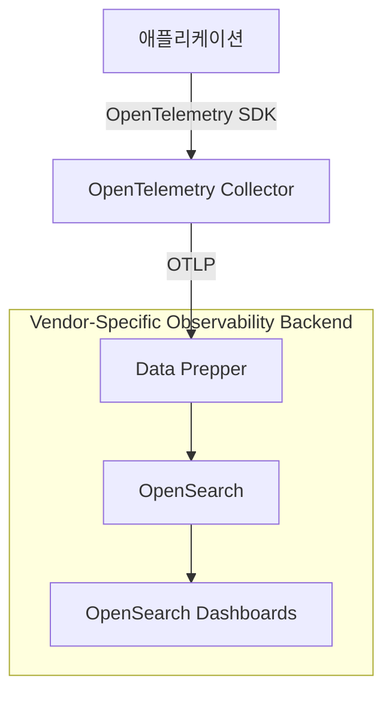

# OpenTelemetry와 OpenSearch를 활용한 분산 추적 시각화 예제

이 예제는 OpenTelemetry Collector를 사용하여 애플리케이션에서 수집된 로그, 트레이스 및 메트릭 데이터를
OpenSearch로 전송하고, OpenSearch Dashboards를 통해 시각화하는 방법을 보여줍니다.
Data Prepper는 OpenTelemetry Collector와 OpenSearch 사이에서 데이터 변환 및 처리 역할을 합니다.

## 기술 스택

- `OpenSearch`
- `OpenSearch Dashboards`
- `Data Prepper`
- `OpenTelemetry Collector`

## 수집되는 데이터 유형

- `Log`: 애플리케이션 및 시스템 로그 데이터로, 오류 및 이벤트 추적에 사용됩니다.
- `Trace`: 애플리케이션에서 생성된 분산 추적 데이터로, 요청의 흐름과 성능 병목 현상을 파악하는 데 사용됩니다.
- `Metric`: 시스템 및 애플리케이션 성능 지표로, CPU 사용량, 메모리 사용량, 응답 시간 등을 포함합니다.

## 아키텍처 다이어그램

> OpenTelemetry Collector는 벤더에 종속되지 않는 표준 수집 레이어로 동작합니다.
> Observability 백엔드는(Data Prepper + OpenSearch) 명확히 분리되어 있어,
> 애플리케이션 계측 변경 없이 다른 백엔드로 교체가 가능합니다.