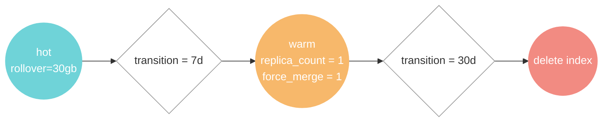

# ISM (Index State Management) Policies

이 디렉토리에는 OpenSearch의 Index State Management(ISM) 정책들이 포함되어 있습니다.

## 정책 흐름

모든 정책은 다음의 `hot -> warm -> delete` 생명주기를 따릅니다:



## 정책 설명

### 1. Log Policy (`log-policy.json`)

- **적용 대상**: `logs-otel-v1-*` 패턴의 인덱스
- **목적**: 애플리케이션 로그 데이터 관리
- **우선순위**: 100

### 2. Metric Policy (`metric-policy.json`)

- **적용 대상**: `ss4o_metrics-otel-*` 패턴의 인덱스
- **목적**: 메트릭 데이터 관리
- **우선순위**: 100

### 3. Trace Policy (`trace-policy.json`)

- **적용 대상**: `otel-v1-apm-span-*` 패턴의 인덱스
- **목적**: APM 트레이스 데이터 관리
- **우선순위**: 100

## 각 상태별 동작

| 상태         | 기간    | 동작                              |
|------------|-------|---------------------------------|
| **hot**    | 0-7일  | 신규 데이터 수집, Rollover 조건 모니터링     |
| **warm**   | 7-30일 | 레플리카 감소(2→1), 세그먼트 병합, 쿼리 성능 유지 |
| **delete** | 30일+  | 인덱스 자동 삭제                       |

## 자동 적용

Docker Compose 시작 시 `ism-policy-applier` 서비스에서 `apply-policies.sh` 스크립트를 실행하여 자동으로 정책들이 OpenSearch에 등록됩니다.

## 수동 적용

```bash
# http://localhost:9200에 OpenSearch가 실행 중인지 확인한 후 다음 명령어로 정책을 수동 적용할 수 있습니다.
sh apply-policies.sh
```
